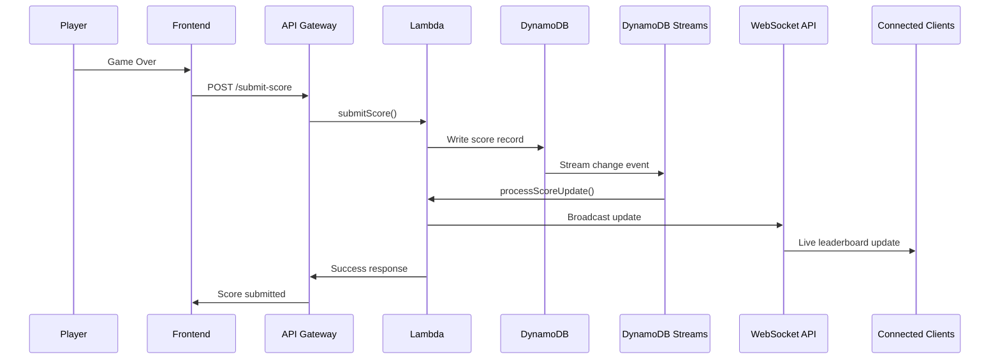
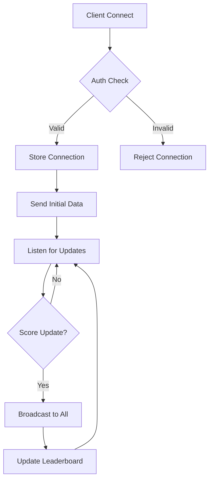

# Game Vibe Plane - Real-time Space Survival Game

A fast-paced space survival game with **real-time global leaderboards** where you navigate through cosmic hazards, collect power-ups, and compete with players worldwide.

## 🎮 Game Overview

Game Vibe Plane is an action-packed web-based arcade game featuring real-time multiplayer leaderboards. Navigate your spacecraft through increasingly challenging space hazards while competing for the top spot on global and country-based leaderboards.

### 🌟 Key Features

- **🏆 Real-time Global Leaderboards**: Compete with players worldwide with live updates
- **🌍 Country Rankings**: Countries ranked by top 10% of players' combined scores
- **⚡ Dynamic Event System**: Experience random cosmic events like asteroid showers, plasma storms, and magnetic fields
- **💎 Power-ups & Shields**: Collect crystal shards for temporary protection
- **📊 Live Statistics**: Track your progress with detailed statistics and death analytics
- **🔄 WebSocket Integration**: Real-time updates without page refresh
- **📱 Responsive Design**: Play on desktop, tablet, or mobile devices

### 🎯 Game Mechanics

1. **Movement**: Mouse/touch control for precise spacecraft navigation
2. **Scoring**: Earn points through movement and survival time
3. **Survival**: Avoid asteroids, missiles, black holes, lasers, and other hazards
4. **Events**: Random cosmic events that change gameplay dynamics
5. **Competition**: Real-time ranking against global players

## 🏗️ System Architecture

### 🎯 Overview

Stellar Drift uses a modern serverless architecture designed for scalability, performance, and global reach. The system supports real-time multiplayer features with automatic scaling and cost optimization.

### 🖥️ Frontend Architecture

#### Core Technologies
- **HTML5 Canvas** - High-performance 2D rendering engine
- **Vanilla JavaScript** - Zero-dependency game engine for maximum performance
- **CSS3 Grid/Flexbox** - Responsive layout system with mobile-first design
- **WebSocket API** - Real-time bidirectional communication
- **Web Audio API** - Immersive spatial audio system
- **LocalStorage** - Client-side persistence for settings and progress

#### Component Structure
```
frontend/
├── index.html                 # Main application entry point
├── gameConfig.js             # Global game configuration
├── css/                      # Modular styling system
│   ├── styles.css           # Core responsive styles
│   ├── leaderboard.css      # Real-time dashboard styling
│   ├── settings.css         # Configuration UI styles
│   └── playerName.css       # Player input validation styles
├── js/
│   ├── config/              # Configuration management
│   │   ├── environment.js   # Environment & .env support
│   │   ├── endpoints.js     # API endpoint management
│   │   └── settings.js      # Multi-language settings system
│   ├── core/                # Game engine core
│   │   ├── game.js          # Main game loop & physics
│   │   ├── gameStateManager.js # State machine management
│   │   ├── eventSystem.js   # Dynamic event system
│   │   └── entityFactory.js # Entity creation & management
│   ├── entities/            # Game objects
│   │   ├── player.js        # Player spacecraft logic
│   │   ├── obstacles.js     # Hazards & obstacles
│   │   ├── collectibles.js  # Power-ups & bonuses
│   │   └── visuals.js       # Particle effects & visuals
│   ├── ui/                  # User interface
│   │   ├── menuSystem.js    # Navigation & screens
│   │   ├── dashboard.js     # Real-time leaderboard
│   │   ├── settingsUI.js    # Configuration interface
│   │   └── playerNameUI.js  # Player validation system
│   ├── audio/               # Audio system
│   │   ├── audioSystem.js   # Core audio management
│   │   ├── musicSystem.js   # Background music control
│   │   └── soundEffects.js  # Spatial sound effects
│   └── utils/               # Utility functions
│       ├── helpers.js       # Common utilities
│       └── userIdentification.js # Player identification
└── assets/
    └── audio/               # Game audio files
```

#### Modern Features
- **Progressive Web App** ready architecture
- **Responsive Design** - Mobile-first with touch optimization
- **Multi-language Support** - 20+ languages with RTL support
- **Environment Configuration** - `.env` file support with fallbacks
- **Accessibility** - WCAG 2.1 compliant with keyboard navigation
- **Performance Monitoring** - Built-in FPS and memory tracking

### ☁️ Backend Architecture (AWS Serverless)

#### Infrastructure Components
- **Amazon API Gateway** - RESTful API endpoints with CORS
- **AWS Lambda** - Serverless compute functions (Node.js 18+)
- **Amazon DynamoDB** - NoSQL database with auto-scaling
- **DynamoDB Streams** - Real-time data change processing
- **WebSocket API** - Persistent connections for live updates
- **CloudWatch** - Monitoring, logging, and alerting
- **AWS IAM** - Fine-grained security permissions

#### API Endpoints
```
POST /submit-score          # Submit player score
GET  /leaderboard/global    # Get global top players
GET  /leaderboard/country   # Get country rankings
GET  /health                # Health check endpoint
WS   /connect               # WebSocket connection
WS   /disconnect            # WebSocket disconnection
```

#### Data Models
```javascript
// Player Score Record
{
  playerId: "uuid",
  playerName: "string",
  score: "number",
  survivalTime: "number",
  country: "string",
  timestamp: "ISO8601",
  gameVersion: "string"
}

// Country Ranking
{
  country: "string",
  topScore: "number",
  averageScore: "number",
  playerCount: "number",
  lastUpdated: "ISO8601"
}
```

### 🔄 Real-time Data Flow

#### Score Submission Flow


#### WebSocket Connection Management


### 🌐 Global Infrastructure

#### Multi-Region Support
- **Primary Region**: ap-southeast-1 (Singapore)
- **Failover Region**: us-east-1 (N. Virginia)
- **CDN**: CloudFront for global asset delivery
- **DNS**: Route 53 with health checks and failover

#### Performance Optimizations
- **Edge Caching** - Static assets cached globally
- **Connection Pooling** - Efficient database connections
- **Auto Scaling** - Lambda concurrency and DynamoDB scaling
- **Compression** - Gzip compression for all text assets
- **Minification** - Optimized JavaScript and CSS delivery

### 🔒 Security Architecture

#### Frontend Security
- **Content Security Policy** - XSS protection
- **HTTPS Enforcement** - All connections encrypted
- **Input Validation** - Client-side sanitization
- **Rate Limiting** - Prevents spam and abuse
- **No Sensitive Data** - No credentials stored client-side

#### Backend Security
- **IAM Roles** - Least privilege access
- **VPC Integration** - Network isolation
- **Encryption** - Data encrypted at rest and in transit
- **API Keys** - Request authentication
- **CORS Configuration** - Cross-origin request control

#### Data Privacy
- **Minimal Data Collection** - Only necessary game data
- **Country-Level Geolocation** - No precise location tracking
- **GDPR Compliant** - Right to deletion and data portability
- **No Personal Information** - Only usernames and scores stored

### 📊 Monitoring & Analytics

#### Real-time Monitoring
- **CloudWatch Dashboards** - System health visualization
- **Custom Metrics** - Game-specific performance indicators
- **Alerting** - Automated incident response
- **Log Aggregation** - Centralized error tracking

#### Performance Metrics
- **Response Time** - API endpoint latency
- **Throughput** - Requests per second
- **Error Rate** - Failed request percentage
- **WebSocket Connections** - Active player count
- **Database Performance** - Query execution time

#### Game Analytics
- **Player Engagement** - Session duration and frequency
- **Difficulty Progression** - Score distribution analysis
- **Feature Usage** - Settings and language preferences
- **Geographic Distribution** - Player location insights

### 🚀 Deployment & DevOps

#### Continuous Integration
```yaml
# GitHub Actions Workflow
name: Deploy Stellar Drift
on:
  push:
    branches: [main]
jobs:
  deploy-backend:
    runs-on: ubuntu-latest
    steps:
      - uses: actions/checkout@v3
      - name: Deploy to AWS
        run: |
          cd backend
          npm install
          npm run deploy
  
  deploy-frontend:
    runs-on: ubuntu-latest
    steps:
      - uses: actions/checkout@v3
      - name: Deploy to S3/CloudFront
        run: |
          cd frontend
          aws s3 sync . s3://stellar-drift-frontend
          aws cloudfront create-invalidation
```

#### Infrastructure as Code
- **Serverless Framework** - Infrastructure definition
- **CloudFormation** - AWS resource management
- **Environment Separation** - Dev/staging/production isolation
- **Automated Rollbacks** - Safe deployment practices

### 💰 Cost Optimization

#### Serverless Benefits
- **Pay-per-Use** - No idle server costs
- **Automatic Scaling** - Scales to zero when unused
- **No Infrastructure Management** - Reduced operational overhead

#### Estimated Costs (Monthly)
- **1,000 games/day**: ~$2-5 USD
- **10,000 games/day**: ~$15-25 USD
- **100,000 games/day**: ~$100-200 USD

#### Cost Breakdown
- **Lambda Invocations**: $0.20 per 1M requests
- **DynamoDB**: $0.25 per GB stored + $1.25 per million reads
- **API Gateway**: $3.50 per million API calls
- **Data Transfer**: $0.09 per GB (first 1GB free)

### 🔮 Future Enhancements

#### Planned Features
- **Machine Learning** - AI-powered difficulty adjustment
- **Real-time Chat** - Player communication system
- **Tournament Mode** - Competitive events and seasons
- **Mobile Apps** - Native iOS and Android versions
- **VR Support** - Virtual reality gameplay mode

#### Scalability Roadmap
- **Multi-Region Deployment** - Global latency optimization
- **Edge Computing** - Game logic at CDN edge locations
- **Blockchain Integration** - NFT achievements and rewards
- **Microservices** - Service decomposition for larger scale

## 🚀 Quick Start

### For Players
1. Open `frontend/index.html` in a modern web browser
2. Click "Start Battle" to begin playing
3. Check the "Live Dashboard" for real-time leaderboards
4. Compete for the top spots globally and in your country!

### For Developers

#### Frontend Development
```bash
cd frontend
# Serve locally (optional)
npx live-server
```

#### Backend Deployment
```bash
cd backend
npm install
npm run deploy  # Deploy to AWS
```

See [Backend README](backend/README.md) for detailed deployment instructions.

## 📊 Leaderboard System

### Global Leaderboard
- **Top 10 players** worldwide by highest score
- **Real-time updates** when new high scores are achieved
- Shows player name, country, score, and survival time

### Country Rankings
- **Top 10 countries** ranked by combined score of top 10% players
- **Fair competition** - prevents countries with many players from dominating
- **Live updates** as players from each country improve

### Statistics Tracking
- Personal best scores and survival times
- Death cause analytics (asteroids, missiles, etc.)
- Games played and average performance
- Local storage backup for offline play

## 🌍 Global Competition Features

### Real-time Updates
- **Live leaderboard** updates via WebSocket
- **Instant notifications** when rankings change
- **Connection status** indicator shows live/offline state

### Country Detection
- **Automatic IP geolocation** with multiple fallback services
- **Flag display** for visual country representation
- **Privacy-conscious** - only country-level data stored

### Fair Ranking Algorithm
Countries ranked by **top 10% of players** ensures:
- Quality over quantity competition
- Small countries can compete with large ones
- Encourages skill development over participation

## 🛠️ Development Guide

### 🚀 Quick Setup

#### Prerequisites
- Modern web browser (Chrome 90+, Firefox 88+, Safari 14+)
- Node.js 18+ (for backend development)
- AWS CLI configured (for deployment)
- Git for version control

#### Frontend Setup
```bash
# Clone the repository
git clone https://github.com/your-username/stellar-drift.git
cd stellar-drift/frontend

# Copy environment configuration
cp .env.example .env

# Edit .env with your backend URLs
nano .env

# Serve locally (choose one)
npx live-server --port=8080
# or
python -m http.server 8080
# or
php -S localhost:8080
```

#### Backend Setup
```bash
cd backend

# Install dependencies
npm install

# Configure AWS credentials
aws configure

# Deploy to AWS
npm run deploy

# View deployment info
npm run info
```

### 🔧 Configuration Management

#### Environment Variables
Create a `.env` file in the frontend directory:

```env
# Required: Backend URLs
VITE_API_BASE_URL=https://your-api.execute-api.region.amazonaws.com/prod
VITE_WEBSOCKET_URL=wss://your-ws.execute-api.region.amazonaws.com/prod

# Optional: Feature flags
VITE_ENABLE_LEADERBOARD=true
VITE_ENABLE_REAL_TIME_UPDATES=true
VITE_DEBUG_MODE=false

# Optional: Performance tuning
VITE_API_TIMEOUT=10000
VITE_WEBSOCKET_RECONNECT_ATTEMPTS=3
```

#### Configuration API
```javascript
// Access configuration in your code
const apiUrl = window.getConfig('apiBaseUrl');
const isDebug = window.getConfig('debugMode', false);

// Check feature flags
if (window.isFeatureEnabled('leaderboard')) {
  initializeLeaderboard();
}

// Runtime configuration changes
window.environmentConfig.set('debugMode', true, true); // persist=true
```

### 🎨 Customization Guide

#### Adding New Languages
1. **Add language definition**:
```javascript
// In js/config/settings.js
languages: {
  newLang: {
    code: 'xx',
    name: 'Language Name',
    flag: '🏁'
  }
}
```

2. **Add translations**:
```javascript
translations: {
  xx: {
    'menu.title': 'Translated Title',
    'menu.startBattle': 'Start Battle Translation',
    // ... add all translation keys
  }
}
```

3. **Test the language**:
```javascript
// In browser console
window.gameSettings.setLanguage('xx');
```

#### Theming & Styling
The game uses CSS custom properties for easy theming:

```css
:root {
  /* Primary colors */
  --primary-color: #00ffff;        /* Cyan theme */
  --danger-color: #ff4444;         /* Red for hazards */
  --energy-color: #aa66cc;         /* Purple for energy */
  --highlight-color: #ffbb33;      /* Gold for highlights */
  
  /* UI colors */
  --background-color: #050510;     /* Dark space background */
  --text-color: #ffffff;           /* White text */
  --border-color: rgba(0, 255, 255, 0.25); /* Translucent borders */
}

/* Dark theme variant */
.theme-dark {
  --primary-color: #ff6b6b;
  --background-color: #1a1a2e;
}

/* Light theme variant */
.theme-light {
  --primary-color: #4ecdc4;
  --background-color: #f7f7f7;
  --text-color: #333333;
}
```

#### Game Mechanics Customization
Edit `gameConfig.js` to modify game behavior:

```javascript
const GAME_CONFIG = {
  // Difficulty progression
  difficulty: {
    baseSpeed: 1.0,              // Base game speed
    speedIncrement: 0.1,         // Speed increase per level
    baseSpawnInterval: 2000,     // Base spawn rate (ms)
    spawnDecrement: 50,          # Spawn rate increase per level
  },
  
  // Event system
  events: {
    interval: 1000,              // Points between events
    duration: 5000,              // Event duration (ms)
    types: ['asteroidShower', 'missileBarrage', 'laserGrid']
  },
  
  // Visual effects
  visual: {
    particles: true,             // Enable particle effects
    screenShake: true,           // Enable screen shake
    backgroundEffects: true,     // Enable background effects
    maxParticles: 100           // Particle limit for performance
  }
};
```

### 🧪 Testing & Quality Assurance

#### Manual Testing Checklist
- [ ] **Responsive Design**: Test on mobile, tablet, desktop
- [ ] **Cross-browser**: Chrome, Firefox, Safari, Edge
- [ ] **Touch Controls**: Verify touch input works smoothly
- [ ] **Language Switching**: Test all supported languages
- [ ] **Settings Persistence**: Verify settings save/load correctly
- [ ] **Network Conditions**: Test with slow/unstable connections
- [ ] **Accessibility**: Keyboard navigation and screen readers

#### Performance Testing
```javascript
// Enable performance monitoring
localStorage.setItem('stellarDriftConfig', JSON.stringify({
  debugMode: true,
  showConsoleLogs: true
}));

// Monitor FPS in console
setInterval(() => {
  console.log('FPS:', Math.round(1000 / deltaTime));
}, 1000);
```

#### Debug Tools
```javascript
// Game state inspection
console.log('Game State:', window.gameStateManager.getCurrentStateName());
console.log('Player Position:', player.x, player.y);
console.log('Active Entities:', asteroids.length, missiles.length);

// Performance metrics
console.log('Memory Usage:', performance.memory);
console.log('Timing:', performance.now());
```

### 📦 Build & Deployment

#### Frontend Deployment Options

**Option 1: Static Hosting (Recommended)**
```bash
# Deploy to Netlify
npm install -g netlify-cli
netlify deploy --prod --dir=frontend

# Deploy to Vercel
npm install -g vercel
cd frontend && vercel --prod

# Deploy to AWS S3 + CloudFront
aws s3 sync frontend/ s3://your-bucket-name
aws cloudfront create-invalidation --distribution-id YOUR_ID --paths "/*"
```

**Option 2: GitHub Pages**
```bash
# Enable GitHub Pages in repository settings
# Push to gh-pages branch
git subtree push --prefix frontend origin gh-pages
```

**Option 3: Docker Container**
```dockerfile
FROM nginx:alpine
COPY frontend/ /usr/share/nginx/html/
COPY nginx.conf /etc/nginx/nginx.conf
EXPOSE 80
CMD ["nginx", "-g", "daemon off;"]
```

#### Backend Deployment
```bash
cd backend

# Install Serverless Framework
npm install -g serverless

# Deploy to AWS
serverless deploy --stage prod

# Deploy specific function
serverless deploy function --function submitScore

# View logs
serverless logs --function submitScore --tail
```

#### CI/CD Pipeline
```yaml
# .github/workflows/deploy.yml
name: Deploy Stellar Drift
on:
  push:
    branches: [main]
    
jobs:
  test:
    runs-on: ubuntu-latest
    steps:
      - uses: actions/checkout@v3
      - name: Run tests
        run: npm test
        
  deploy-backend:
    needs: test
    runs-on: ubuntu-latest
    steps:
      - uses: actions/checkout@v3
      - name: Setup Node.js
        uses: actions/setup-node@v3
        with:
          node-version: '18'
      - name: Deploy backend
        run: |
          cd backend
          npm ci
          npm run deploy
        env:
          AWS_ACCESS_KEY_ID: ${{ secrets.AWS_ACCESS_KEY_ID }}
          AWS_SECRET_ACCESS_KEY: ${{ secrets.AWS_SECRET_ACCESS_KEY }}
          
  deploy-frontend:
    needs: [test, deploy-backend]
    runs-on: ubuntu-latest
    steps:
      - uses: actions/checkout@v3
      - name: Deploy to S3
        run: |
          aws s3 sync frontend/ s3://${{ secrets.S3_BUCKET }}
          aws cloudfront create-invalidation --distribution-id ${{ secrets.CLOUDFRONT_ID }} --paths "/*"
```

### 🔍 Monitoring & Debugging

#### Error Tracking
```javascript
// Global error handler
window.addEventListener('error', (event) => {
  console.error('Game Error:', {
    message: event.message,
    filename: event.filename,
    lineno: event.lineno,
    colno: event.colno,
    error: event.error
  });
  
  // Send to monitoring service
  if (window.isFeatureEnabled('analytics')) {
    sendErrorReport(event);
  }
});
```

#### Performance Monitoring
```javascript
// Monitor game performance
class PerformanceMonitor {
  constructor() {
    this.frameCount = 0;
    this.lastTime = performance.now();
    this.fps = 60;
  }
  
  update() {
    this.frameCount++;
    const currentTime = performance.now();
    
    if (currentTime - this.lastTime >= 1000) {
      this.fps = this.frameCount;
      this.frameCount = 0;
      this.lastTime = currentTime;
      
      // Log performance warnings
      if (this.fps < 30) {
        console.warn('Low FPS detected:', this.fps);
      }
    }
  }
}
```

### 🤝 Contributing Guidelines

#### Code Style
- Use ES6+ features (const/let, arrow functions, destructuring)
- Follow consistent naming conventions (camelCase for variables, PascalCase for classes)
- Add JSDoc comments for functions
- Keep functions small and focused
- Use meaningful variable names

#### Pull Request Process
1. Fork the repository
2. Create a feature branch: `git checkout -b feature/new-feature`
3. Make your changes with tests
4. Update documentation
5. Submit a pull request with clear description

#### Issue Reporting
When reporting bugs, include:
- Browser and version
- Device type (desktop/mobile/tablet)
- Steps to reproduce
- Expected vs actual behavior
- Console errors (if any)
- Screenshots/videos (if applicable)

## 🔧 Configuration

### Backend Configuration
Update `frontend/js/api/backendApi.js`:
```javascript
const BACKEND_CONFIG = {
  API_BASE_URL: "https://your-api-id.execute-api.region.amazonaws.com/stage",
  USE_BACKEND: true,
  FALLBACK_TO_LOCAL: true
};
```

### Game Configuration
Modify `frontend/gameConfig.js` for:
- Difficulty progression
- Event frequencies and types
- Scoring mechanics
- Visual and audio settings

## 📈 Performance & Scalability

### Cost-Optimized AWS Architecture
- **DynamoDB**: Pay-per-request pricing
- **Lambda**: Serverless with generous free tier
- **API Gateway**: Pay-per-request with WebSocket support
- **Expected cost**: $1-5 USD/month for moderate usage (1000+ games)

### Real-time Performance
- **WebSocket connections** for instant updates
- **DynamoDB Streams** for efficient real-time processing
- **Optimized queries** with Global Secondary Indexes
- **Connection management** with automatic cleanup

### Scalability Features
- **Serverless architecture** scales automatically
- **Global deployment** possible with CloudFront
- **Multi-region support** for reduced latency
- **Efficient caching** strategies for leaderboards

## 🎮 Game Events & Features

### Dynamic Events
- **Asteroid Showers**: Waves of space debris
- **Missile Barrages**: Guided projectile attacks
- **Plasma Storms**: Energy field hazards
- **Magnetic Storms**: Electromagnetic interference
- **Black Hole Chains**: Gravitational anomalies
- **Crystal Rain**: Collectible power-up events
- **Laser Grids**: Precision beam patterns
- **Wormhole Portals**: Teleportation effects

### Power-ups & Abilities
- **Crystal Shields**: Temporary invincibility
- **Energy Orbs**: Score multipliers
- **Thunder Shield**: Lightning strike abilities
- **Quantum Portals**: Emergency teleportation

## 🚨 Troubleshooting

### Common Issues

#### Frontend Issues
- **Events not triggering**: Check browser console for JavaScript errors
- **Leaderboard not loading**: Verify backend configuration and internet connection
- **WebSocket connection fails**: Check CORS settings and WebSocket URL format

#### Backend Issues
- **Deployment fails**: Verify AWS credentials and permissions
- **CORS errors**: Check API Gateway CORS configuration
- **DynamoDB errors**: Verify IAM roles and table permissions

### Debug Mode
Enable detailed logging:
```javascript
// In browser console
localStorage.setItem('debug', 'true');
```

## 📝 License

This project is licensed under the MIT License - see the [LICENSE](LICENSE) file for details.

## 🙏 Acknowledgments

- **AWS Serverless** for scalable backend infrastructure
- **Multiple GeoIP services** for reliable country detection
- **Web Audio API** for immersive sound experience
- **HTML5 Canvas** for high-performance graphics
- **Font Awesome** for UI icons
- **All contributors** who helped improve the game

## 🔗 Links

- [Backend Documentation](backend/README.md)
- [Live Demo](https://your-game-url.com) _(Update with actual URL)_
- [AWS Architecture Guide](backend/README.md#architecture)

---

**Ready to compete globally? Start playing and climb the leaderboards!**

_Last updated: October 2024_
