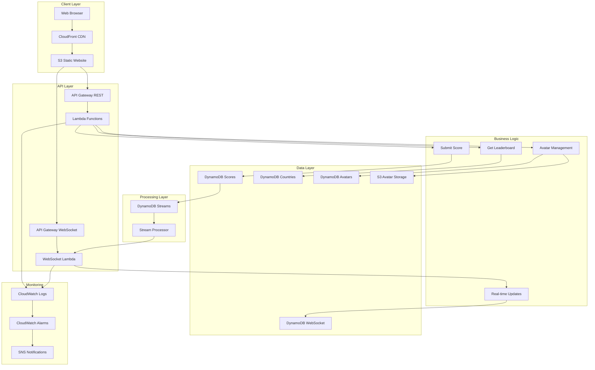

# 🚀 Game Vibe Plane - Complete Gaming Platform

A modern, serverless space survival game with real-time multiplayer features, avatar system, and global leaderboards. Built with AWS best practices for scalability, cost optimization, and performance.

## 🎮 Game Features

- **🎯 Real-time Global Leaderboards** - Compete with players worldwide
- **👤 Avatar System** - Choose from predefined avatars or upload custom images
- **🌍 Country-based Rankings** - See how your country stacks up globally
- **🔄 Real-time Updates** - Live leaderboard updates via WebSocket
- **📱 Cross-platform** - Works on desktop, tablet, and mobile devices
- **🎵 Immersive Audio** - Dynamic sound effects and background music
- **⚙️ Customizable Settings** - Adjust graphics, audio, and gameplay preferences
- **🌐 Multi-language Support** - 20+ languages supported

## 🏗️ Architecture Overview

### AWS Serverless Architecture


```mermaid
graph TB
    subgraph "Client Layer"
        A[Web Browser] --> B[CloudFront CDN]
        B --> C[S3 Static Website]
    end
    
    subgraph "API Layer"
        C --> D[API Gateway REST]
        C --> E[API Gateway WebSocket]
        D --> F[Lambda Functions]
        E --> G[WebSocket Lambda]
    end
    
    subgraph "Business Logic"
        F --> H[Submit Score]
        F --> I[Get Leaderboard]
        F --> J[Avatar Management]
        G --> K[Real-time Updates]
    end
    
    subgraph "Data Layer"
        H --> L[DynamoDB Scores]
        I --> M[DynamoDB Countries]
        J --> N[DynamoDB Avatars]
        J --> O[S3 Avatar Storage]
        K --> P[DynamoDB WebSocket]
    end
    
    subgraph "Processing Layer"
        L --> Q[DynamoDB Streams]
        Q --> R[Stream Processor]
        R --> G
    end
    
    subgraph "Monitoring"
        F --> S[CloudWatch Logs]
        G --> S
        S --> T[CloudWatch Alarms]
        T --> U[SNS Notifications]
    end
```

### Core AWS Services

| Service | Purpose | Configuration |
|---------|---------|---------------|
| **Lambda** | Serverless compute | ARM64, right-sized memory allocation |
| **API Gateway** | REST & WebSocket APIs | Rate limiting, caching, CORS |
| **DynamoDB** | NoSQL database | Pay-per-request, streams enabled |
| **S3** | Avatar storage | Lifecycle policies, versioning |
| **CloudWatch** | Monitoring & logging | Custom metrics, alarms |
| **CloudFront** | CDN (recommended) | Edge caching, compression |

## 📊 Database Schema

### Scores Table
```yaml
Primary Key: userId (String)
Attributes:
  - username: String
  - score: Number
  - survivalTime: Number
  - country: String
  - countryCode: String
  - avatar: Object (optional)
  - timestamp: Number
  - createdAt: String
  - updatedAt: String

Global Secondary Indexes:
  - ScoreIndex: leaderboard (HASH) + score (RANGE)
  - CountryIndex: country (HASH) + score (RANGE)
  - TimestampIndex: leaderboard (HASH) + timestamp (RANGE)
```

### Avatars Table
```yaml
Primary Key: userId (String)
Attributes:
  - avatar: Object
    - type: String (predefined|custom)
    - category: String (for predefined)
    - id: String (for predefined)
    - emoji: String (for predefined)
    - url: String (for custom)
    - s3Key: String (for custom)
    - uploadedAt: String
  - updatedAt: String
```

### Countries Table
```yaml
Primary Key: country (String)
Attributes:
  - totalScore: Number
  - playerCount: Number
  - averageScore: Number
  - top10PercentScore: Number
  - lastUpdated: String

Global Secondary Index:
  - TotalScoreIndex: ranking (HASH) + totalScore (RANGE)
```

## 🚀 Quick Start

### Prerequisites
- Node.js 18+ 
- AWS CLI configured
- Serverless Framework v3

### Backend Deployment

```bash
# Navigate to backend directory
cd backend

# Install dependencies
npm install

# Deploy to development
npm run deploy

# Deploy to production
npm run deploy:prod
```

### Frontend Setup

```bash
# Navigate to frontend directory
cd frontend

# Serve locally (choose one)
npx serve -p 8080
python -m http.server 8080
live-server --port=8080
```

### Environment Configuration

Create environment-specific configurations:

```yaml
# backend/config/development.yml
allowedOrigins: "*"
enableRequestLogging: true
enableMetrics: false

# backend/config/production.yml
allowedOrigins: "https://vibeplane.io,https://www.vibeplane.io"
enableRequestLogging: false
enableMetrics: true
```

## 📡 API Documentation

### REST Endpoints

#### Submit Score
```http
POST /submit-score
Content-Type: application/json

{
  "userId": "user123",
  "username": "Player1",
  "score": 15420,
  "survivalTime": 225,
  "deathCause": "asteroid collision"
}
```

#### Get Global Leaderboard
```http
GET /leaderboard?limit=10
```

#### Get Country Leaderboard
```http
GET /leaderboard/country?country=USA&limit=10
```

#### Upload Avatar
```http
POST /upload-avatar
Content-Type: application/json

{
  "userId": "user123",
  "fileData": "base64EncodedImageData",
  "fileName": "avatar.jpg",
  "fileType": "image/jpeg"
}
```

#### Update Avatar
```http
POST /update-avatar
Content-Type: application/json

{
  "userId": "user123",
  "avatar": {
    "type": "predefined",
    "category": "space",
    "id": "astronaut",
    "emoji": "👨‍🚀",
    "name": "Astronaut"
  }
}
```

### WebSocket API

#### Connection
```javascript
const ws = new WebSocket('wss://your-api-id.execute-api.region.amazonaws.com/stage');

// Subscribe to updates
ws.send(JSON.stringify({ action: 'subscribe' }));

// Handle messages
ws.onmessage = (event) => {
  const message = JSON.parse(event.data);
  console.log('Received:', message);
};
```

#### Message Types
```javascript
// Leaderboard update
{
  "type": "leaderboard_update",
  "timestamp": 1634567890123,
  "data": {
    "type": "global",
    "leaderboard": [...]
  }
}

// Country update
{
  "type": "country_update",
  "timestamp": 1634567890123,
  "data": {
    "type": "countries",
    "countries": [...]
  }
}
```

## 💰 Cost Optimization

### Implemented Strategies

1. **Compute Optimization**
   - ARM64 architecture (20% cost reduction)
   - Right-sized memory allocation
   - Reserved concurrency limits

2. **Storage Optimization**
   - Pay-per-request DynamoDB billing
   - S3 lifecycle policies
   - Automatic cleanup of expired data

3. **Network Optimization**
   - API Gateway caching
   - Response compression
   - Regional deployment

### Estimated Monthly Costs

| Scale | Lambda | DynamoDB | S3 | API Gateway | Total |
|-------|--------|----------|----|-----------  |-------|
| Small (1K games) | $0.50 | $1.00 | $0.25 | $0.35 | ~$2.30 |
| Medium (10K games) | $3.00 | $5.00 | $1.50 | $3.50 | ~$14.00 |
| Large (100K games) | $15.00 | $25.00 | $8.00 | $35.00 | ~$88.00 |

## 🔒 Security Features

### API Security
- CORS configuration
- Input validation and sanitization
- Rate limiting and throttling
- Request/response logging

### Data Security
- Encrypted data at rest (DynamoDB, S3)
- Secure file upload validation
- IP-based geolocation
- User fingerprinting for duplicate detection

### Infrastructure Security
- IAM roles with least privilege
- VPC endpoints (recommended for production)
- CloudTrail logging
- Security group restrictions

## 📈 Monitoring & Observability

### CloudWatch Metrics
- Lambda function performance
- DynamoDB read/write capacity
- API Gateway request metrics
- Custom business metrics

### Alarms & Notifications
```yaml
# High error rate alarm
HighErrorRateAlarm:
  Threshold: 10 errors in 5 minutes
  Action: SNS notification

# High latency alarm  
HighLatencyAlarm:
  Threshold: 10 seconds average
  Action: SNS notification

# Cost alarm
DailySpendAlarm:
  Threshold: $10/day
  Action: Email notification
```

### Logging Strategy
- Structured JSON logging
- 30-day log retention
- Centralized error tracking
- Performance monitoring

## 🧪 Testing Strategy

### Backend Testing
```bash
# Unit tests
npm test

# Integration tests
npm run test:integration

# Load testing
npm run test:load
```

### Frontend Testing
```bash
# Unit tests
npm run test:unit

# E2E tests
npm run test:e2e

# Performance tests
npm run test:performance
```

## 🚀 Deployment Pipeline

### CI/CD Workflow
```yaml
# .github/workflows/deploy.yml
name: Deploy
on:
  push:
    branches: [main, develop]

jobs:
  test:
    runs-on: ubuntu-latest
    steps:
      - uses: actions/checkout@v3
      - name: Run tests
        run: npm test

  deploy:
    needs: test
    runs-on: ubuntu-latest
    steps:
      - name: Deploy to AWS
        run: serverless deploy --stage ${{ github.ref_name }}
```

### Environment Strategy
- **Development**: Feature development and testing
- **Staging**: Production-like environment for final testing
- **Production**: Live environment with full monitoring

## 📚 Additional Documentation

- [Cost Optimization Guide](COST_OPTIMIZATION.md)
- [File Structure Guide](FILE_STRUCTURE.md)
- [Deployment Guide](DEPLOYMENT.md)
- [API Reference](docs/api/README.md)
- [Architecture Decision Records](docs/architecture/README.md)

## 🤝 Contributing

1. Fork the repository
2. Create a feature branch (`git checkout -b feature/amazing-feature`)
3. Commit your changes (`git commit -m 'Add amazing feature'`)
4. Push to the branch (`git push origin feature/amazing-feature`)
5. Open a Pull Request

### Development Guidelines
- Follow the established file structure
- Write comprehensive tests
- Update documentation
- Follow cost optimization practices

## 🐛 Troubleshooting

### Common Issues

1. **CORS Errors**
   - Verify API Gateway CORS configuration
   - Check allowed origins in serverless.yml

2. **WebSocket Connection Fails**
   - Ensure WebSocket URL uses `wss://`
   - Check network connectivity and firewall settings

3. **Avatar Upload Fails**
   - Verify file size < 2MB
   - Check file format (JPG, PNG, GIF only)
   - Ensure S3 bucket permissions

4. **High Costs**
   - Review CloudWatch cost metrics
   - Check for runaway Lambda functions
   - Verify DynamoDB usage patterns

### Debug Mode
```javascript
// Enable debug logging
localStorage.setItem('gameDebug', 'true');
location.reload();
```

## 📄 License

This project is licensed under the MIT License - see the [LICENSE](LICENSE) file for details.

## 🙏 Acknowledgments

- AWS Serverless Application Model (SAM)
- Serverless Framework
- Game development community
- Open source contributors

---

**Ready to play?** Visit [vibeplane.io](https://vibeplane.io) and start your space adventure!

**Need help?** Check our [documentation](docs/) or open an [issue](https://github.com/your-org/game-vibe-plane/issues).